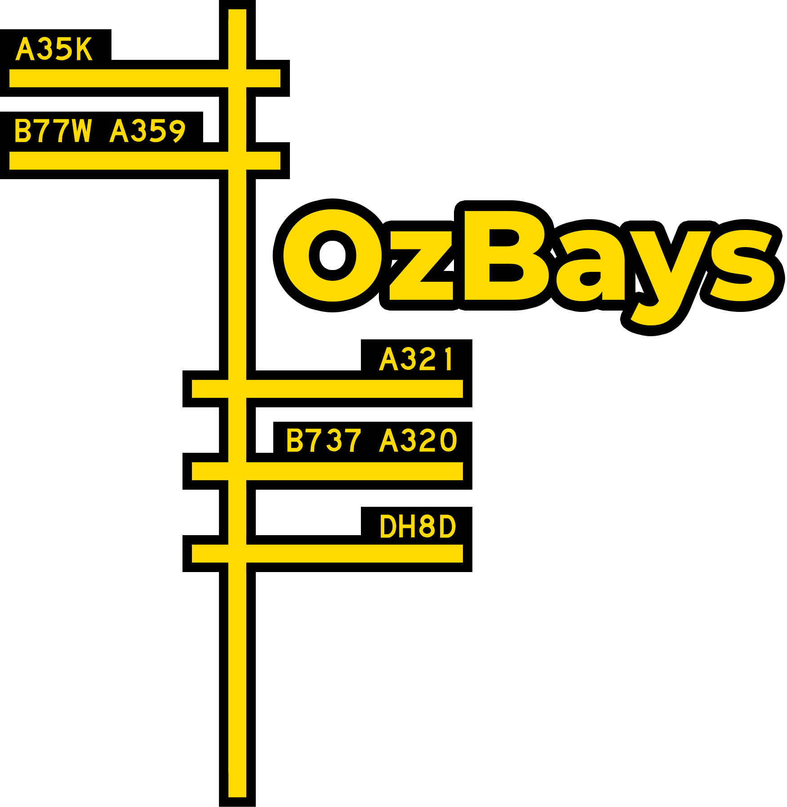

<p align="center">
  <a href="https://ozbays.xyz" target="_blank">
    
  </a>
</p>

<h1 align="center">OzBays</h1>

<p align="center">
  <strong>Automatic bay assignment for VATSIM Australia Pacific (VATPAC) controlled airports.</strong>
</p>

<p align="center">
  <a href="https://ozbays.xyz"></a>
  
  
  
  <a href="LICENSE"></a>
</p>

---

OzBays watches the live [VATSIM](https://vatsim.net) network and automatically assigns arrival bays to aircraft inbound to supported Australian airports — then tells the pilot about it, just like the real world does. It mirrors real-life gate assignments where possible, resolves conflicts when someone parks on your bay, and uplinks the assignment straight to the cockpit over CPDLC.

> **Status:** OzBays is in active alpha development and is currently **not deployed** for operational use on the VATSIM network.

## Features

- ✈️ **Automatic bay assignment** — inbound aircraft are matched to a suitable bay based on aircraft type/wingspan group, operator preferences, freight vs passenger operations, and domestic/international status.
- 🌏 **Real-world bay mirroring** — scheduled arrival data feeds real-life gate assignments into the allocator, so the network flight parks where the real flight did (when it fits!).
- 📡 **Hoppie CPDLC / TELEX uplinks** — pilots connected to the [Hoppie ACARS network](https://www.hoppie.nl/acars/) on VATSIM receive their assigned bay as a datalink uplink before arrival.
- 🔄 **Conflict resolution** — if an aircraft parks on a bay that's already assigned to an arrival, the inbound aircraft is automatically reassigned (immediately when it's within 5NM).
- 🗺️ **Live map** — every monitored aircraft and the live status of every bay (available / booked / occupied) on an interactive map.
- 🛬 **Arrival ladders & flight displays** — a FIDS-style arrival board per airport, plus a boarding-gate-style display for each flight.
- 🖥️ **OzStrips integration** — a JSON API exposing live assignments for [OzStrips](https://ozstrips.vatpac.org/) and other VATPAC tooling.
- 🔔 **Discord integration** — bay assignments, conflicts, and system events streamed to Discord, with account linking and role sync.
- 🛡️ **Role-based administration** — VATSIM Connect SSO sign-in, with a maintainer approval workflow for airport data changes.

## How it works

A set of scheduled jobs keeps everything in sync:

| Job | Schedule | What it does |
| --- | --- | --- |
| `FlightData` | Every minute | Pulls the VATSIM datafeed, tracks every flight inbound to a supported airport, and computes landing/on-blocks estimates. |
| `BayAllocation` | Every minute | Detects bay occupancy, books bays for arrivals, resolves conflicts, and sends Hoppie/Discord notifications. |
| `LiveBaysJob` | Hourly | Fetches real-world scheduled arrivals and maps their gates onto OzBays bay definitions. |
| `AerodromeUpdates` | On demand | Syncs airport and bay definitions from the airport configuration JSON. |

Airport and bay definitions (coordinates, allowed aircraft groups, operator priorities, terminals) live in `public/config/airport.json`, with aircraft type groups in `public/config/aircraft.json`.

## Getting started

Requires **PHP 8.2+**, **Composer**, **Node.js**, and a MySQL database (SQLite works for local development).

```bash
git clone https://github.com/JoshuaMicallefYBSU/OzBays.git
cd OzBays

# Install dependencies, create .env, generate a key, migrate, and build assets
composer setup

# Run the dev server, queue worker, log viewer, and Vite together
composer dev
```

You'll also need to configure a few services in `.env`:

| Key | Purpose |
| --- | --- |
| `CONNECT_*` | [VATSIM Connect](https://vatsim.dev/services/connect/) OAuth credentials for sign-in |
| `HOPPIE_LOGON` | Hoppie ACARS logon code for CPDLC/TELEX uplinks |
| `DISCORD_*` | Discord bot token, OAuth client, and guild for notifications & account linking |
| `API_*_KEY` | Flight schedule API keys for real-world bay data |

The scheduler drives the update jobs — in production run `php artisan schedule:run` each minute (cron), alongside a queue worker.

## Testing

```bash
composer test
```

The suite runs on an in-memory SQLite database with the external services (Discord, Hoppie, VATSIM) faked.

## Contributing

Found a bug or have an idea? [Open an issue](https://github.com/JoshuaMicallefYBSU/OzBays/issues) — bug reports from pilots and controllers using the site are especially welcome. Pull requests should target the `Next-Release` branch.

## License

OzBays is open-source software licensed under the [Apache License 2.0](LICENSE).

<p align="center">
  <sub>© Joshua Micallef · OzBays is a community project for flight simulation on the VATSIM network and is not affiliated with any real-world airline or airport operator.</sub>
</p>
